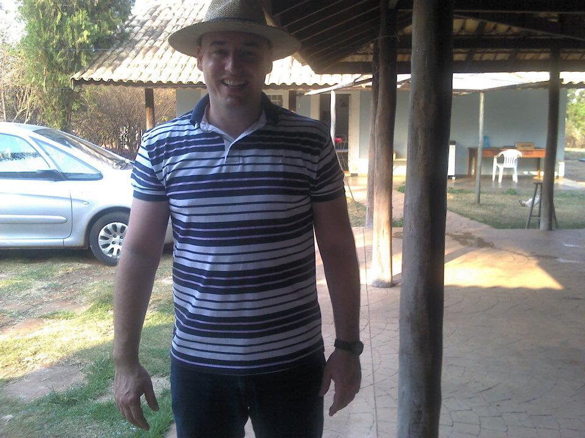

# Blindview

## Introdução

O Blindview é um projeto desenvolvido para melhorar a acessibilidade de pessoas com deficiência visual. Utilizando técnicas de deep learning e processamento de imagens, o Blindview converte imagens capturadas em descrições de áudio, permitindo uma interpretação auditiva do ambiente ao redor.

## Objetivo

O objetivo do Blindview é fornecer uma ferramenta que transforma a percepção visual em auditiva, auxiliando pessoas com deficiência visual a navegar e entender melhor seu entorno.

## Funcionalidades

- **Captura de Imagens**: Utilização de câmeras para capturar imagens em tempo real.
- **Processamento de Imagens**: Modelos de deep learning são aplicados para análise e interpretação das imagens.
- **Geração de Áudio**: As interpretações visuais são convertidas em descrições de áudio detalhadas.

## Tecnologias Utilizadas

- **Python**: Linguagem principal utilizada no desenvolvimento.
- **Twilio**: Faz a ligação do WhatsApp com a api que roda no COLAB.
- **NGROK**: Deixa disponível a api através de tunel criado, para ela aparecer com link virtual, mesmo estando em um servidor do COLAB.
- **GEMINI**: I.A. Generativa da Google que analisa a imagem e faz a descrição em texto.
- **GTTs**: Google Text-to-Speech API para geração das descrições de áudio.

## Exemplo de uso:



A imagem mostra um homem de meia idade, com um chapéu de palha na cabeça, uma camisa polo listrada azul e branca e calças pretas. Ele está sorrindo e tem um relógio no pulso esquerdo. Ao fundo, há uma casa de campo com uma varanda e um carro branco estacionado na garagem.


A imagem é de um pedaço de carne vermelha grelhado, cortado em fatias finas. A carne está disposta sobre uma tábua de madeira, acompanhada de um molho verde. A carne tem um tom rosado, com algumas partes mais escuras, indicando que foi grelhada em fogo alto. As fatias são finas e uniformes, e estão dispostas de forma organizada sobre a tábua. O molho verde é feito de ervas frescas, como salsa e cebolinha, e adiciona um toque de frescor ao prato. A tábua está apoiada sobre uma superfície de tecido branco, o que dá um toque de elegância à apresentação.


O personagem tem uma cabeça amarela e um grande nariz. Ele está usando um macacão cinza com listras pretas. Ele tem uma expressão séria no rosto.


A imagem mostra um vinhedo com uma fileira de videiras no primeiro plano e outras fileiras de videiras ao fundo. As videiras estão cobertas de folhas verdes e há um poste de madeira no centro da imagem. Ao fundo, há uma paisagem de montanhas cobertas de árvores.


A imagem mostra o ciclo de vida da ciência de dados, que começa com a coleta de dados. Os dados são então limpos e preparados para análise. Em seguida, os dados são analisados para encontrar padrões e insights. Esses insights são então usados para criar modelos de aprendizado de máquina. Os modelos são então implantados em produção e usados para fazer previsões. O ciclo de vida da ciência de dados é um processo iterativo que pode ser repetido conforme necessário.


Um homem está em pé, em uma sala, vestindo um quimono branco com detalhes em vermelho e uma faixa branca na cintura. Ele segura um bastão de madeira nas mãos e tem um sorriso no rosto. Atrás dele, há uma porta branca e um sofá marrom.


A imagem é um símbolo de yin e yang, que representa o equilíbrio entre as forças opostas da natureza. O símbolo é composto por dois círculos, um preto e um branco, que estão interligados. O círculo preto representa o yin, que é o princípio feminino, e o círculo branco representa o yang, que é o princípio masculino. Os dois círculos estão cercados por uma borda de espinhos, que representa a proteção e a força.

## Estrutura do Projeto

```plaintext
├── BlindView.ipynb
├── README.md
├── imagem1.jpg
├── imagem1.mp3
├── imagem2.jpg
├── imagem2.mp3
├── imagem3.png
├── imagem3.mp3
├── imagem4.jpg
├── imagem4.mp3
├── imagem5.jpg
├── imagem5.mp3
├── imagem6.jpg
├── imagem6.mp3
├── imagem7.jpg
├── imagem7.mp3

